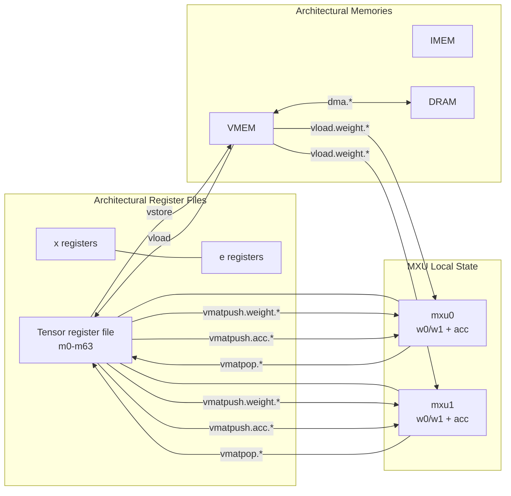

# Penguin Architecture Specification

Status: Baseline 1.0

## 1. Scope

This document is the normative architecture-visible specification for Penguin-TPU.

It defines:

- the architectural execution model
- the visible machine state
- the architectural memory map
- instruction encodings and instruction semantics
- architecturally visible data formats
- architecturally visible halt and error behavior
- frozen architectural constants shared by software, the model, RTL, and system integration

This document does not define a specific pipeline, arbitration network, or datapath
partition. Those subjects are defined in the microarchitecture specification.

## 2. Normative Language

The key words `shall`, `must`, `must not`, `should`, and `may` are to be interpreted as
requirements for any conforming Penguin implementation or model.

Conformance to this specification means conformance of the following software-visible
surfaces:

- assembly source and binary encoding
- runtime memory images
- machine-visible execution state
- architecturally visible instruction results
- architecturally visible halt and error behavior

## 3. Architectural Overview

Penguin is a statically scheduled accelerator-oriented machine with a scalar control path
and a tile-oriented tensor datapath.

The baseline machine contains:

- one architectural scalar integer register file of `32` registers, `x0` through `x31`
- one architectural tensor register file of `64` registers, `m0` through `m63`
- one architectural scale register file of `32` registers, `e0` through `e31`
- one scalar integer control path
- two architecturally visible matrix execution units, `mxu0` and `mxu1`
- one vector processing unit, `vpu`
- one tensor transform / reduction unit, `xlu`
- one instruction memory, `IMEM`
- one on-chip tensor/vector memory, `VMEM`
- one off-chip backing memory, `DRAM`
- eight architected DMA channels between `DRAM` and `VMEM`

The machine is intentionally narrow in the frontend:

- one fixed-width `32`-bit instruction stream
- one fetch stream
- at most one new instruction issued per cycle

The machine is intentionally explicit at the asynchronous boundary:

- on-chip execution is deterministic for a fixed instruction sequence and configuration
- `DRAM <-> VMEM` transfer is asynchronous and channelized
- all other architected tensor and scalar transfers are blocking

## 4. Architectural Execution Model

### 4.1 General rules

The baseline Penguin execution model shall satisfy the following rules:

- instructions are fixed-width `32`-bit words
- the frontend fetches and issues instructions strictly in program order
- the frontend issues at most one new instruction per cycle
- issue stalls only on structural conflicts and architecturally defined blocking
  conditions
- long-chime instructions may remain active for multiple cycles after issue
- different execution units may be active concurrently
- younger instructions may issue and execute while older long-chime instructions remain
  active, provided the older instructions do not impose an architectural fence or a
  targeted-unit structural stall
- architectural state updates become visible when the producing instruction completes;
  the machine does not define a separate precise commit stage in this revision

### 4.2 Control-flow delay slots

Branches and jumps shall have exactly `2` architecturally visible delay slots.

For a control-transfer instruction at architectural instruction index `pc`:

- the instructions at `pc + 1` and `pc + 2` shall issue and retire regardless of
  redirect status
- if the control transfer is not taken, those same delay-slot instructions still issue
  and retire
- a branch or jump that appears in either delay-slot position is illegal and shall
  terminate execution with illegal-instruction halt status

This rule applies to:

- `jal`
- `jalr`
- `beq`
- `bne`
- `blt`
- `bge`
- `bltu`
- `bgeu`

### 4.3 Halt model

The baseline architecture shall support explicit host-visible completion and error halt
observation.

Penguin does not provide a general trap-and-resume architectural model in this revision.
Illegal or misaligned architectural behavior stops execution and reports halt status.

Architecturally meaningful stop classes are:

- normal end-of-program completion
- `ecall`
- `ebreak`
- illegal instruction
- instruction-address misaligned
- misaligned scalar memory access
- illegal DMA issue
- other architecturally defined fatal model errors

## 5. Architectural State

### 5.1 Scalar state

The scalar architectural state shall include:

- `32` general-purpose integer registers, `x0` through `x31`
- one `32`-bit program counter `pc`

Requirements:

- each scalar register stores one `32`-bit value
- `x0` is hardwired to zero
- `pc` stores the architectural instruction-word index
- under normal sequential execution, `pc` is incremented by `1`

### 5.2 Tensor and scale state

The tensor and scale architectural state shall include:

- `64` tensor registers, `m0` through `m63`
- `32` scale registers, `e0` through `e31`
- two weight slots per MXU: `mxu0.w0`, `mxu0.w1`, `mxu1.w0`, and `mxu1.w1`
- two accumulation buffers per MXU:
  `mxu0.acc0`, `mxu0.acc1`, `mxu1.acc0`, and `mxu1.acc1`

Tensor-register requirements:

- each tensor register stores `64` rows
- each row stores exactly `64` bytes
- each tensor register therefore stores `4096` raw bytes
- the tensor register file is flat and type-agnostic
- tensor element interpretation is selected by instruction semantics, not by storage
  class

Whole-register views:

- one `m` register stores one `64 x 64` `FP8_E4M3` tile
- one `m` register stores one `64 x 32` `BF16` half-tile
- one full `64 x 64` `BF16` tile therefore occupies two consecutive `m` registers when
  materialized in the tensor register file

Scale-register requirements:

- each `e` register stores one `FP8_E8M0` scale payload
- one `e` register applies to one whole tensor operand, not to a sub-tile region
- `e` registers are distinct from both scalar `x` registers and tensor `m` registers

Accumulator-buffer requirements:

- each MXU-local accumulation buffer stores one `64 x 64 BF16` tile
- each accumulation buffer therefore stores `8192` raw bytes
- accumulation buffers are written by MXU instructions
- accumulation buffers are loaded from and stored to tensor registers only
- accumulation buffers are not directly addressed as `m` registers

### 5.3 DMA architectural state

The DMA architectural state shall include:

- one architecturally visible base address register, `dma.base`
- one architecturally visible busy / idle state bit per DMA channel

Requirements:

- `dma.base` stores a `32`-bit address contribution used by `dma.load.chN` and
  `dma.store.chN`
- `dma.base` is shared across all channels in the current baseline
- `dma.wait.chN` observes the busy state of the selected channel only

### 5.4 Control and status state

The architecture-visible execution-control plane shall include at least:

- execution enable / halt control
- execution status / stop reason
- `pc` visibility
- DMA busy state visibility for the eight architected DMA channels

The exact MMIO encoding is left to system integration, but the state itself is
architecturally required.

## 6. Architectural Memory Organization

### 6.1 Memory regions

Penguin shall expose three disjoint architectural memory regions.

| Region | Base Address | Size | Role |
|---|---:|---:|---|
| `IMEM` | `0x0002_0000` | `64 KiB` | Instruction memory |
| `VMEM` | `0x2000_0000` | `1 MiB` | On-chip tensor/vector data memory |
| `DRAM` | `0x8000_0000` | `16 GiB` | Off-chip backing data memory |

Memory-region rules:

- `IMEM` is word addressed for architectural `pc` sequencing
- `VMEM` and `DRAM` are byte addressed
- instruction fetch reads `IMEM`
- scalar data load/store access `VMEM` only
- `seld` reads one byte from `VMEM`
- `vload`, `vstore`, and `vload.weight.*` access `VMEM` only
- DMA is the only architected path between `DRAM` and `VMEM`
- the baseline DMA instructions form their off-chip address from `x[...] + dma.base`
  and their on-chip address from the instruction operands specified in Section `9.7`

Illustrative architectural dataflow view:

The diagram is illustrative. The normative architectural rules are the bullets above.

### 6.2 Alignment rules

The following alignment rules are architectural:

- instruction fetch address alignment: `4` bytes
- scalar `lb` / `lbu` / `sb` alignment: `1` byte
- scalar `lh` / `lhu` / `sh` alignment: `2` bytes
- scalar `lw` / `sw` alignment: `4` bytes
- `seld` alignment: `1` byte
- DMA source address alignment: `32` bytes
- DMA destination address alignment: `32` bytes
- DMA size granularity: multiple of `32` bytes
- `vload`, `vstore`, and `vload.weight.*` VMEM address alignment: `32` bytes

### 6.3 Initialization rules

The architecture does not define deterministic reset contents for general data storage.

Unless software or host setup explicitly initializes them:

- `DRAM` contents are architecturally undefined
- `VMEM` contents are architecturally undefined
- scalar registers other than `x0` are architecturally undefined
- `e` registers are architecturally undefined
- tensor registers, MXU weight slots, MXU accumulation buffers, and `dma.base` are
  architecturally undefined

The host shall populate `IMEM` before enabling execution.

## 7. Instruction-Encoding Framework

### 7.1 Fixed-width instruction words

All instructions shall be encoded as fixed-width `32`-bit words.

The baseline format classes are:

- scalar `R`
- scalar `I`
- scalar `S`
- scalar `SB`
- scalar `U`
- scalar `UJ`
- tensor / accelerator `VLS`
- tensor / accelerator `VR`
- tensor / accelerator `VI`

### 7.2 Scalar field layouts

The scalar format classes use the standard `RV32I` field placement.

| Format | Bits `[31:25]` | Bits `[24:20]` | Bits `[19:15]` | Bits `[14:12]` | Bits `[11:7]` | Bits `[6:0]` |
|---|---|---|---|---|---|---|
| `R` | `funct7` | `rs2` | `rs1` | `funct3` | `rd` | `opcode` |
| `I` | `imm[11:5]` | `imm[4:0]` | `rs1` | `funct3` | `rd` | `opcode` |
| `S` | `imm[11:5]` | `rs2` | `rs1` | `funct3` | `imm[4:0]` | `opcode` |
| `SB` | `imm[12|10:5]` | `rs2` | `rs1` | `funct3` | `imm[4:1|11]` | `opcode` |
| `U` | `imm[31:12]` | `imm[31:12]` | `imm[31:12]` | `imm[31:12]` | `rd` | `opcode` |
| `UJ` | `imm[20|10:1|11|19:12]` | `imm[20|10:1|11|19:12]` | `imm[20|10:1|11|19:12]` | `imm[20|10:1|11|19:12]` | `rd` | `opcode` |

### 7.3 Tensor and accelerator field layouts

The tensor and accelerator format classes are frozen as follows.

`VLS`:

| Bit range | Field |
|---|---|
| `[31:20]` | `imm[11:0]` |
| `[19:15]` | `rs1` |
| `[14:13]` | `f2` |
| `[12:7]` | `vd[5:0]` |
| `[6:0]` | `opcode` |

`VR`:

| Bit range | Field |
|---|---|
| `[31:25]` | `funct7` |
| `[24:19]` | `vs2[5:0]` |
| `[18:13]` | `vs1[5:0]` |
| `[12:7]` | `vd[5:0]` |
| `[6:0]` | `opcode` |

`VI`:

| Bit range | Field |
|---|---|
| `[31:16]` | `imm[15:0]` |
| `[15:13]` | `f3` |
| `[12:7]` | `vd[5:0]` |
| `[6:0]` | `opcode` |

For avoidance of ambiguity, the reconstructed architectural operands are defined as:

- `vd = insn[12:7]`
- `vs2 = insn[24:19]`
- `vs1 = insn[18:13]`
- `f2 = insn[14:13]`
- `f3 = insn[15:13]`

`VLS`, `VR`, and `VI` are not RISC-V standard formats. They are Penguin-specific
architecture-visible formats and shall be decoded exactly as defined here.

### 7.4 Major opcode allocation

The baseline opcode allocation is frozen as follows.

| Opcode bits `[6:0]` | Opcode hex | Family |
|---|---:|---|
| `0000011` | `0x03` | Scalar loads plus `seld` and `seli` |
| `0000111` | `0x07` | `VLS` tensor transfer family |
| `0001111` | `0x0F` | `fence` |
| `0010011` | `0x13` | Scalar immediate ALU |
| `0010111` | `0x17` | `auipc` |
| `0100011` | `0x23` | Scalar stores |
| `0110011` | `0x33` | Scalar register ALU |
| `0110111` | `0x37` | `lui` |
| `1010111` | `0x57` | `VR` VPU family |
| `1011111` | `0x5F` | `VI` vector-immediate family |
| `1100011` | `0x63` | Scalar branches |
| `1100111` | `0x67` | `jalr` plus scalar `delay` |
| `1101011` | `0x6B` | `VR` XLU family |
| `1101111` | `0x6F` | `jal` |
| `1110011` | `0x73` | `ecall` and `ebreak` |
| `1110111` | `0x77` | `VR` MXU family |
| `1111011` | `0x7B` | DMA transfer family |
| `1111111` | `0x7F` | DMA control family |

## 8. Scalar ISA

### 8.1 Scalar compatibility scope

Penguin reuses standard `RV32I` scalar field layouts and most standard `RV32I`
mnemonics, but Penguin scalar execution is not binary compatible with a conventional
`RV32I` machine.

The main architectural differences are:

- `pc` is an instruction-word index rather than a byte address
- branches and jumps have exactly `2` architectural delay slots
- opcode `0x03` also carries `seld` and `seli`
- opcode `0x67` also carries `delay`

The baseline scalar core intentionally excludes:

- scalar floating-point instructions
- compressed instructions
- integer multiply/divide extensions
- atomic extensions
- privileged-mode instructions

### 8.2 Upper-immediate instructions

| Mnemonic | Opcode / Match | Semantics |
|---|---|---|
| `lui rd, imm20` | `0x37` | `x[rd] <- imm20 << 12` |
| `auipc rd, imm20` | `0x17` | `x[rd] <- pc + (imm20 << 12)` |

### 8.3 Jumps and branches

| Mnemonic | Opcode / Match | Semantics |
|---|---|---|
| `jal rd, imm` | `0x6F` | `x[rd] <- pc + 1`; redirect to `pc + imm` after `2` delay slots |
| `jalr rd, rs1, imm` | `0x67 / funct3=000` | `target <- x[rs1] + imm`; `x[rd] <- pc + 1`; redirect to `target` after `2` delay slots |
| `beq rs1, rs2, imm` | `0x63 / funct3=000` | branch if `x[rs1] == x[rs2]` |
| `bne rs1, rs2, imm` | `0x63 / funct3=001` | branch if `x[rs1] != x[rs2]` |
| `blt rs1, rs2, imm` | `0x63 / funct3=100` | branch if `signed(x[rs1]) < signed(x[rs2])` |
| `bge rs1, rs2, imm` | `0x63 / funct3=101` | branch if `signed(x[rs1]) >= signed(x[rs2])` |
| `bltu rs1, rs2, imm` | `0x63 / funct3=110` | branch if `unsigned(x[rs1]) < unsigned(x[rs2])` |
| `bgeu rs1, rs2, imm` | `0x63 / funct3=111` | branch if `unsigned(x[rs1]) >= unsigned(x[rs2])` |

If a branch is taken, the redirect target is `pc + imm` after the two required delay
slots. If the branch is not taken, execution continues sequentially after those same
delay-slot instructions retire.

### 8.4 Immediate ALU operations

| Mnemonic | Opcode / Match | Semantics |
|---|---|---|
| `addi rd, rs1, imm` | `0x13 / funct3=000` | `x[rd] <- x[rs1] + imm` |
| `slli rd, rs1, shamt` | `0x13 / funct3=001 / funct7=0000000` | `x[rd] <- x[rs1] << shamt` |
| `slti rd, rs1, imm` | `0x13 / funct3=010` | `x[rd] <- 1` if `signed(x[rs1]) < signed(imm)` else `0` |
| `sltiu rd, rs1, imm` | `0x13 / funct3=011` | `x[rd] <- 1` if `unsigned(x[rs1]) < unsigned(sign_extend(imm))` else `0` |
| `xori rd, rs1, imm` | `0x13 / funct3=100` | `x[rd] <- x[rs1] xor imm` |
| `srli rd, rs1, shamt` | `0x13 / funct3=101 / funct7=0000000` | `x[rd] <- unsigned(x[rs1]) >> shamt` |
| `srai rd, rs1, shamt` | `0x13 / funct3=101 / funct7=0100000` | `x[rd] <- signed(x[rs1]) >>> shamt` |
| `ori rd, rs1, imm` | `0x13 / funct3=110` | `x[rd] <- x[rs1] or imm` |
| `andi rd, rs1, imm` | `0x13 / funct3=111` | `x[rd] <- x[rs1] and imm` |

### 8.5 Register-register ALU operations

| Mnemonic | Opcode / Match | Semantics |
|---|---|---|
| `add rd, rs1, rs2` | `0x33 / funct3=000 / funct7=0000000` | `x[rd] <- x[rs1] + x[rs2]` |
| `sub rd, rs1, rs2` | `0x33 / funct3=000 / funct7=0100000` | `x[rd] <- x[rs1] - x[rs2]` |
| `sll rd, rs1, rs2` | `0x33 / funct3=001 / funct7=0000000` | `x[rd] <- x[rs1] << x[rs2][4:0]` |
| `slt rd, rs1, rs2` | `0x33 / funct3=010 / funct7=0000000` | `x[rd] <- 1` if `signed(x[rs1]) < signed(x[rs2])` else `0` |
| `sltu rd, rs1, rs2` | `0x33 / funct3=011 / funct7=0000000` | `x[rd] <- 1` if `unsigned(x[rs1]) < unsigned(x[rs2])` else `0` |
| `xor rd, rs1, rs2` | `0x33 / funct3=100 / funct7=0000000` | `x[rd] <- x[rs1] xor x[rs2]` |
| `srl rd, rs1, rs2` | `0x33 / funct3=101 / funct7=0000000` | `x[rd] <- unsigned(x[rs1]) >> x[rs2][4:0]` |
| `sra rd, rs1, rs2` | `0x33 / funct3=101 / funct7=0100000` | `x[rd] <- signed(x[rs1]) >>> x[rs2][4:0]` |
| `or rd, rs1, rs2` | `0x33 / funct3=110 / funct7=0000000` | `x[rd] <- x[rs1] or x[rs2]` |
| `and rd, rs1, rs2` | `0x33 / funct3=111 / funct7=0000000` | `x[rd] <- x[rs1] and x[rs2]` |

All scalar integer arithmetic is modulo `2^32` unless signed comparison semantics are
explicitly stated.

### 8.6 Scalar memory and scale-register operations

| Mnemonic | Opcode / Match | Semantics |
|---|---|---|
| `lb rd, imm(rs1)` | `0x03 / funct3=000` | `x[rd] <- sign_extend(VMEM8[x[rs1] + imm])` |
| `lh rd, imm(rs1)` | `0x03 / funct3=001` | `x[rd] <- sign_extend(VMEM16[x[rs1] + imm])` |
| `lw rd, imm(rs1)` | `0x03 / funct3=010` | `x[rd] <- VMEM32[x[rs1] + imm]` |
| `lbu rd, imm(rs1)` | `0x03 / funct3=100` | `x[rd] <- zero_extend(VMEM8[x[rs1] + imm])` |
| `lhu rd, imm(rs1)` | `0x03 / funct3=101` | `x[rd] <- zero_extend(VMEM16[x[rs1] + imm])` |
| `seld eD, imm(rs1)` | `0x03 / funct3=110` | `e[D] <- VMEM8[x[rs1] + imm]` |
| `seli eD, imm` | `0x03 / funct3=111` | `e[D] <- imm[7:0]` |
| `sb rs2, imm(rs1)` | `0x23 / funct3=000` | `VMEM8[x[rs1] + imm] <- x[rs2][7:0]` |
| `sh rs2, imm(rs1)` | `0x23 / funct3=001` | `VMEM16[x[rs1] + imm] <- x[rs2][15:0]` |
| `sw rs2, imm(rs1)` | `0x23 / funct3=010` | `VMEM32[x[rs1] + imm] <- x[rs2]` |

Scale-register rules:

- `seld` and `seli` are the only architectural writers of `e` registers in the current
  baseline
- `seld` transfers exactly one byte from `VMEM`
- `seli` writes the low `8` bits of its `I`-format immediate into the selected `e`
  register
- for `seli`, software shall encode `rs1 = x0`; nonzero `rs1` is reserved

Scalar-memory rules:

- scalar data-memory instructions access `VMEM` only
- `lb`, `lbu`, and `sb` have byte alignment
- `lh`, `lhu`, and `sh` require `2`-byte alignment
- `lw` and `sw` require `4`-byte alignment
- misaligned scalar memory access is a fatal architectural error

### 8.7 Ordering, delay, and environment operations

| Mnemonic | Opcode / Match | Semantics |
|---|---|---|
| `fence` | `0x0F / funct3=000 / imm12=000000000000` | architecturally legal; baseline no-op |
| `delay N` | `0x67 / funct3=001` | hold decode / issue for `N` cycles, then retire |
| `ecall` | `0x73 / funct3=000 / imm12=000000000000` | terminate execution with environment-call halt status |
| `ebreak` | `0x73 / funct3=000 / imm12=000000000001` | terminate execution with breakpoint halt status |

Architectural rules:

- `delay` uses `I` format under opcode `0x67`
- `delay` interprets its immediate as an unsigned `12`-bit cycle count in the range
  `[0, 4095]`
- `delay` shall not redirect control flow
- software shall encode `rd = x0` and `rs1 = x0` for `delay`; nonzero values are
  reserved
- while `delay N` is active, the instruction occupies decode / issue and younger
  instructions shall not issue
- `delay 0` is architecturally legal and retires without holding decode beyond its own
  decode cycle

## 9. Tensor and Accelerator ISA

### 9.1 Tensor data views

The tensor register file shall support the following architecturally visible views.

| View | Elements per row | Logical tile shape | Storage rule |
|---|---:|---|---|
| `FP8_E4M3` | `64` | `64 x 64` | one byte per element across the full `64`-byte row |
| `BF16` | `32` | `64 x 32` | one `BF16` element per `2` bytes across the full `64`-byte row |

The architecture deliberately decouples MXU compute geometry from tensor-storage byte
symmetry:

- MXU compute tiles are square `64 x 64`
- VPU and XLU operate on the full `64 x 32 BF16` whole-register view
- `FP8` source tiles use the full-width `64 x 64` packing inside one `m` register
- `BF16` tiles expand into two consecutive `m` registers when materialized in the tensor
  register file

### 9.2 VLS tensor-transfer family

The `VLS` family uses opcode `0x07`.

| `f2` | Mnemonic | Semantics |
|---|---|---|
| `00` | `vload mD, imm(xA)` | `m[D] <- VMEM[x[A] + (imm12 << 5)]` |
| `01` | `vstore mS, imm(xA)` | `VMEM[x[A] + (imm12 << 5)] <- m[S]` |
| `10` | `vload.weight.mxu0 wW, imm(xA)` | `mxu0.wW <- VMEM[x[A] + (imm12 << 5)]` |
| `11` | `vload.weight.mxu1 wW, imm(xA)` | `mxu1.wW <- VMEM[x[A] + (imm12 << 5)]` |

Rules:

- the effective VMEM byte offset is `sign_extend(imm12) << 5`
- `vload` and `vstore` use the full `6`-bit `vd` field as tensor-register selector
- `vload.weight.*` uses `vd[0]` as the weight-slot selector `w0` / `w1`
- for `vload.weight.*`, `vd[5:1]` shall be zero; nonzero values are reserved
- the VMEM address shall be `32`-byte aligned

### 9.3 VPU whole-register family

The VPU family uses `VR` format with opcode `0x57`.

| `funct7` | Mnemonic | Semantics |
|---|---|---|
| `0000000` | `vadd.bf16` | `m[vd] <- m[vs1].bf16 + m[vs2].bf16` |
| `0000001` | `vredsum.bf16` | `m[vd][0, :] <- reduce_sum_rows(m[vs1].bf16)` |
| `0000010` | `vsub.bf16` | `m[vd] <- m[vs1].bf16 - m[vs2].bf16` |
| `0000100` | `vmin.bf16` | `m[vd] <- min(m[vs1].bf16, m[vs2].bf16)` |
| `0000110` | `vmax.bf16` | `m[vd] <- max(m[vs1].bf16, m[vs2].bf16)` |
| `0100100` | `vmul.bf16` | `m[vd] <- m[vs1].bf16 * m[vs2].bf16` |
| `1000000` | `vmov` | `m[vd] <- m[vs1]` |
| `1000001` | `vrecip.bf16` | `m[vd] <- recip(m[vs1].bf16)` |
| `1000010` | `vexp` | `m[vd] <- exp(m[vs1].bf16)` |
| `1000100` | `vrelu` | `m[vd] <- relu(m[vs1].bf16)` |

Rules:

- binary `VPU` operations read `vs1` and `vs2`
- unary `VPU` operations read `vs1` and shall encode `vs2 = 0`
- all `VPU` operations write one whole tensor register result to `vd`

### 9.4 VI vector-immediate family

The `VI` family uses opcode `0x5F`.

| `f3` | Mnemonic | Semantics |
|---|---|---|
| `000` | `vli.all` | `m[vd][:] <- imm16` |
| `001` | `vli.row` | `m[vd][0, :] <- imm16` |
| `010` | `vli.col` | `m[vd][:, 0] <- imm16` |
| `011` | `vli.one` | `m[vd][0, 0] <- imm16` |

Rules:

- `imm16` is sign-extended within the consuming operation as required by datatype
  interpretation
- bits `[31:16]` carry the immediate payload
- bits `[15:13]` carry the `f3` subopcode

### 9.5 XLU whole-register family

The XLU family uses `VR` format with opcode `0x6B`.

| `funct7` | Mnemonic | Semantics |
|---|---|---|
| `0000000` | `vtrpose.xlu` | `m[vd] <- transpose(m[vs1].bf16)` |
| `0000001` | `vreduce.max.xlu` | `m[vd][:, 0] <- reduce_max_rows(m[vs1].bf16)` |
| `0000010` | `vreduce.sum.xlu` | `m[vd][:, 0] <- reduce_sum_rows(m[vs1].bf16)` |

Rules:

- `XLU` operations read `vs1`
- `XLU` operations write one whole tensor register result to `vd`
- `XLU` operations shall encode `vs2 = 0`; nonzero `vs2` is reserved
- the mnemonic spelling `vtrpose.xlu` is architecturally frozen by the current
  greencard reference

### 9.6 MXU whole-register family

The MXU family uses `VR` format with opcode `0x77`.

| `funct7` | Mnemonic | Semantics |
|---|---|---|
| `0000000` | `vmatpush.weight.mxu0` | `mxu0.w[vd[0]] <- m[vs1]` |
| `0000001` | `vmatpush.weight.mxu1` | `mxu1.w[vd[0]] <- m[vs1]` |
| `0000010` | `vmatpush.acc.fp8.mxu0` | `mxu0.acc[vd[0]] <- dequantize_fp8(m[vs1])` |
| `0000011` | `vmatpush.acc.fp8.mxu1` | `mxu1.acc[vd[0]] <- dequantize_fp8(m[vs1])` |
| `0000100` | `vmatpush.acc.bf16.mxu0` | `mxu0.acc[vd[0]] <- bf16_pair(m[vs1], m[vs1 + 1])` |
| `0000101` | `vmatpush.acc.bf16.mxu1` | `mxu1.acc[vd[0]] <- bf16_pair(m[vs1], m[vs1 + 1])` |
| `0000110` | `vmatpop.fp8.acc.mxu0` | `m[vd] <- quantize_fp8(mxu0.acc[vs2[0]])` |
| `0000111` | `vmatpop.fp8.acc.mxu1` | `m[vd] <- quantize_fp8(mxu1.acc[vs2[0]])` |
| `0001000` | `vmatpop.bf16.acc.mxu0` | `{m[vd], m[vd + 1]} <- mxu0.acc[vs2[0]]` |
| `0001001` | `vmatpop.bf16.acc.mxu1` | `{m[vd], m[vd + 1]} <- mxu1.acc[vs2[0]]` |
| `0001010` | `vmatmul.mxu0` | `mxu0.acc[vd[0]] <- m[vs1].fp8 @ mxu0.w[vs2[0]].fp8` |
| `0001011` | `vmatmul.mxu1` | `mxu1.acc[vd[0]] <- m[vs1].fp8 @ mxu1.w[vs2[0]].fp8` |
| `0001100` | `vmatmul.acc.mxu0` | `mxu0.acc[vd[0]] <- mxu0.acc[vd[0]] + m[vs1].fp8 @ mxu0.w[vs2[0]].fp8` |
| `0001101` | `vmatmul.acc.mxu1` | `mxu1.acc[vd[0]] <- mxu1.acc[vd[0]] + m[vs1].fp8 @ mxu1.w[vs2[0]].fp8` |

Rules:

- `vmatpush.weight.*` uses `vs1` as tensor source and `vd[0]` as weight-slot selector
- `vmatpush.weight.*` shall encode `vs2 = 0` and `vd[5:1] = 0`
- `vmatpush.acc.fp8.*` reads one `FP8` tensor register from `vs1` and uses `vd[0]` as
  accumulator selector; `vs2 = 0` and `vd[5:1] = 0`
- `vmatpush.acc.bf16.*` reads a two-register `BF16` tile from `{m[vs1], m[vs1 + 1]}`
  and uses `vd[0]` as accumulator selector; `vs1` shall be even, `vs2 = 0`, and
  `vd[5:1] = 0`
- `vmatpop.fp8.acc.*` writes one `FP8` tensor register to `vd` and uses `vs2[0]` as
  accumulator selector; `vs1 = 0` and `vs2[5:1] = 0`
- `vmatpop.bf16.acc.*` writes a two-register `BF16` tile to `{m[vd], m[vd + 1]}` and
  uses `vs2[0]` as accumulator selector; `vd` shall be even, `vs1 = 0`, and
  `vs2[5:1] = 0`
- `vmatmul.*` uses `vd[0]` as accumulator selector, `vs1` as activation register
  selector, and `vs2[0]` as weight-slot selector; `vd[5:1] = 0` and `vs2[5:1] = 0`
- MXU arithmetic is `FP8_E4M3 x FP8_E4M3 -> BF16`

### 9.7 DMA families

The DMA transfer family uses scalar `R` format with opcode `0x7B`.

| `funct7` | Mnemonic | Semantics |
|---|---|---|
| `0000000` | `dma.load.chN rd, rs1, rs2` | issue `DRAM -> VMEM` transfer on channel `N` with `vmem_addr = x[rd]`, `dram_addr = x[rs1] + dma.base`, `size = x[rs2]` |
| `0000001` | `dma.store.chN rd, rs1, rs2` | issue `VMEM -> DRAM` transfer on channel `N` with `dram_addr = x[rd]`, `vmem_addr = x[rs1] + dma.base`, `size = x[rs2]` |

Rules:

- `N` is encoded in `funct3`
- the `rd` field is used as a source register selector in this family; it does not name a
  writeback destination
- a DMA issue to a busy channel is illegal

The DMA control family uses scalar `I` format with opcode `0x7F`.

| Subop | Mnemonic | Semantics |
|---|---|---|
| `imm[6:0] = 0000000` | `dma.config.chN rs1` | `dma.base <- x[rs1]` |
| `imm[6:0] = 0000001` | `dma.wait.chN` | block frontend until channel `N` is idle |

Rules:

- `N` is encoded in `funct3`
- `dma.config.chN` uses channel-qualified encodings, but the current baseline effect is
  identical for all `N` because `dma.base` is shared
- `dma.config.chN` and `dma.wait.chN` shall encode `rd = x0`
- `dma.wait.chN` shall encode `rs1 = x0`
- `imm[11:7]` is reserved and shall be zero

## 10. Frozen Architectural Constants

The following constants are architecturally frozen in the current baseline.

| Constant | Value |
|---|---:|
| Instruction width | `32` bits |
| Instruction alignment | `4` bytes |
| Control-flow delay slots | `2` |
| Scalar register count | `32` |
| Tensor register count | `64` |
| Scale register count | `32` |
| Tensor-register rows | `64` |
| Tensor-register row bytes | `64` |
| Tensor-register bytes | `4096` |
| MXU count | `2` |
| MXU weight slots per MXU | `2` |
| MXU accumulation-buffer shape | `64 x 64 BF16` |
| DMA channel count | `8` |
| `IMEM` base | `0x0002_0000` |
| `VMEM` base | `0x2000_0000` |
| `DRAM` base | `0x8000_0000` |

Timing-class constants used by the baseline performance model are defined in the
microarchitecture specification.

## 11. Error Conditions

The following conditions shall terminate execution with architectural error status:

- illegal or unsupported instruction
- control-flow instruction placed in a delay slot
- misaligned branch target
- misaligned jump target
- misaligned scalar load or store
- DMA issue to a busy channel
- DMA issue with misaligned address or size
- reserved field written nonzero where this specification requires zero
- any other explicitly defined fatal architectural contract violation

The baseline architecture shall not emulate these cases silently.

## 12. Conformance Surfaces

This architecture specification is the required contract for:

- the `penguin-model` functional and performance model
- the scalar encoder / assembler
- compiler-emitted assembly and executable bundles
- RTL blocks implementing the current baseline machine
- FPGA and system software that launch or observe Penguin execution
