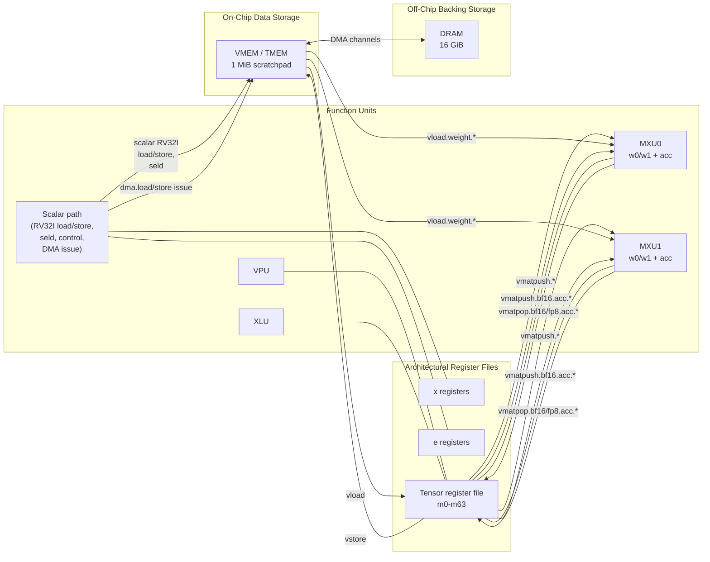

# Penguin Architecture Specification

Status: Baseline 1.0

## 1. Scope

This document is the normative architecture-visible specification for Penguin-TPU.

It defines:

- the architectural execution model
- the visible machine state
- the architectural memory map
- the scalar and tensor instruction-set contract
- architecturally visible data formats
- architecturally visible error and halt behavior
- frozen architectural constants shared by software, the functional model, RTL, and
  system integration

This document does not define a specific RTL pipeline, arbitration network, buffer
implementation, or physical datapath layout. Those subjects are defined in the
microarchitecture specification.

## 2. Normative Language

The key words `shall`, `must`, `must not`, `should`, and `may` are to be interpreted as
requirements for any conforming Penguin implementation or model.

Conformance to this specification means conformance of the following software-visible
surfaces:

- assembly source and binary encoding
- runtime memory images
- machine-visible execution state
- architecturally visible instruction results
- architecturally visible halt and error behavior

## 3. Architectural Overview

Penguin is a statically scheduled accelerator-oriented machine with a scalar control path
and a tile-oriented tensor datapath.

The baseline machine contains:

- one architectural scalar integer register file of `32` registers, `x0` through `x31`
- one architectural tensor register file of `64` registers, `m0` through `m63`
- one architectural scale register file of `32` registers, `e0` through `e31`
- one scalar integer control unit and datapath
- one scalar load store unit, `slsu`
- two architecturally visible matrix execution units, `mxu0` and `mxu1`, with local
  weight and accumulation buffer
- one vector processing unit, `vpu`
- one transpose unit, `xlu`
- one tensor load store unit, `vlsu`
- one instruction memory, `IMEM`
- one on-chip tensor/vector memory, `VMEM`
- one off-chip backing memory, `DRAM`
- eight architected DMA channels between `DRAM` and `VMEM`

Rationale:

- one main tensor register file keeps the operand model small
- bias, reduction, and epilogue convenience do not yet justify a second general-purpose
  tensor-like storage namespace
- narrow metadata-like scale values are handled through dedicated `e` registers instead
  of a second wide tile store

The machine is intentionally narrow in the frontend:

- one fixed-width 32-bit instruction stream
- one fetch stream
- one dispatch decision per cycle

The machine is intentionally explicit at the asynchronous boundary:

- on-chip execution is deterministic for a fixed instruction sequence and configuration
- `DRAM <-> VMEM` transfer is asynchronous and channelized
- all other architected tensor and scalar transfers are blocking

## 4. Architectural Execution Model

### 4.1 General rules

The baseline Penguin execution model shall satisfy the following rules:

- instructions are fixed-width `32`-bit words
- instructions conceptually retire in program order
- the scalar frontend issues at most one new instruction per cycle
- issue shall stall only on structural conflicts and architecturally defined blocking
  conditions
- long-chime instructions (typically tensor operations) may remain active for multiple cycles after issue
- different execution units may be active concurrently
- architectural completion is out-of-order without precise commit points

### 4.2 Control-flow delay slots

Branches and jumps shall have exactly `2` architecturally visible delay slots.

For a control-transfer instruction at address `pc`:

- the instructions at `pc + 1` and `pc + 2` shall be issued and shall retire regardless
  of redirect status
- if the control transfer is not taken, those same delay-slot instructions still issue
  and retire
- a branch or jump that appears in either delay-slot position is illegal and shall
  terminate execution with illegal-instruction halt status

This rule applies to:

- `jal`
- `jalr`
- `beq`
- `bne`
- `blt`
- `bge`
- `bltu`
- `bgeu`

### 4.3 Halt model

The baseline architecture shall support explicit host-visible completion and error halt
observation.

Penguin does not provide a general trap-and-resume architectural model in this revision.
Illegal or misaligned architectural behavior stops execution and reports halt status.

Architecturally meaningful stop classes are:

- normal end-of-program completion
- `ecall`
- `ebreak`
- illegal instruction
- instruction-address misaligned
- misaligned scalar memory access
- illegal DMA issue
- other architecturally defined fatal model errors

## 5. Architectural State

### 5.1 Scalar state

The scalar architectural state shall include:

- `32` general-purpose integer registers, `x0` through `x31`
- one `32`-bit program counter `pc`

Requirements:

- each scalar register stores one `32`-bit value
- `x0` is hardwired to zero
- `pc` stores the architectural instruction-word index
- under normal execution, `pc` is incremented by 1

### 5.2 Tensor state

The tensor architectural state shall include:

- `64` tensor registers, `m0` through `m63`
- two weight slots per MXU: `mxu0.w0`, `mxu0.w1`, `mxu1.w0`, and `mxu1.w1`
- one accumulation buffer per MXU: `mxu0.acc` and `mxu1.acc`

Tensor-register requirements:

- each tensor register stores `64` rows
- each row stores exactly `64` bytes
- each tensor register therefore stores `4096` raw bytes
- the tensor register file is flat and type-agnostic
- tensor element interpretation is selected by the instruction semantics, not by the
  storage class

The architecture intentionally keeps one main tensor-register file sized around a
`64 x 64` FP8 whole-register view:

- one `m` register also stores one `64 x 64` FP8_E4M3 tile
- one `m` register stores one `64 x 32` BF16 half-tile
- one full `64 x 64` BF16 tile therefore occupies two consecutive `m` registers when
  materialized in the tensor register file

Accumulator-buffer requirements:

- each MXU-local accumulation buffer stores one `64 x 64` BF16 tile
- each accumulation buffer therefore stores `8192` raw bytes
- accumulation buffers are written by MXU launch instructions
- accumulation buffers are loaded from and stored to tensor registers only
- accumulation buffers are not directly addressed as `m` registers

Rationale:

- the machine keeps one main tensor register file rather than adding a second wide
  vector-like file
- the compute array is chosen for square FP8 contraction, not for BF16 byte-width
  matching
- BF16 result expansion is handled through paired-register tensor materialization rather
  than through a rectangular MXU geometry

### 5.3 Scale state

The scale architectural state shall include:

- `32` exponent registers, `e0` through `e31`

Scale-register requirements:

- each `e` register stores one `FP8_E8M0` scaling factor
- one `e` register applies to one whole tensor operand, not to per-row or per-block
  subregions
- `e` registers are distinct from both scalar `x` registers and tensor `m` registers
- the raw `8`-bit `e` payload is interpreted as an unbiased signed binary exponent
  `exp8`
- `scale(e)` is therefore defined as `2^exp8`
- `seli eN, 0` encodes unity scale

The baseline architecture uses `e` registers because scale values are metadata-like
operand descriptors, not ordinary scalar integers and not dense tensor tiles.

The exact MXU instruction forms that consume `e` registers are under active revision and
are not frozen by the current matrix-movement baseline in this section.

### 5.4 Control and status state

The architecture-visible execution-control plane shall include at least:

- execution enable / halt control
- execution status / stop reason
- `pc` visibility
- DMA busy state for the eight architected DMA channels

The exact MMIO encoding is left to system integration, but the state itself is
architecturally required.

## 6. Architectural Memory Organization

### 6.1 Memory regions

Penguin shall expose three disjoint architectural memory regions.

| Region | Base Address | Size | Role |
|---|---:|---:|---|
| `IMEM` | `0x0002_0000` | `64 KiB` | Instruction memory |
| `VMEM` | `0x2000_0000` | `1 MiB`  | On-chip tensor/vector data memory |
| `DRAM` | `0x8000_0000` | `16 GiB` | Off-chip backing data memory |

Memory-region rules:

- `IMEM` is 32-bit word addressed
- `VMEM`, and `DRAM` are byte-addressed
- instruction fetch reads `IMEM`
- scalar data load/store access `VMEM` only
- `seld` access to `e` registers reads `VMEM` only
- tensor register load/store and MXU weight load access `VMEM` only
- DMA is the only architected path between `DRAM` and `VMEM`
- `IMEM` and `VMEM` are inside the synchronous domain, which the access latency
  is deterministic

Illustrative architectural memory-hierarchy view:

The diagram is illustrative. The normative architectural rules are the bullets above.

### 6.2 Alignment rules

The following alignment rules are architectural:

- instruction fetch address alignment: `4` bytes (accessed by 32-bit words)
- scalar `lb` / `lbu` / `sb` alignment: `1` byte
- scalar `lh` / `lhu` / `sh` alignment: `2` bytes
- scalar `lw` / `sw` alignment: `4` bytes
- scalar `seld` byte-load alignment: `1` byte
- DMA source address alignment: `32` bytes
- DMA destination address alignment: `32` bytes
- DMA size granularity: multiple of `32` bytes
- `vload`, `vstore`, and `vload.weight.*` VMEM address alignment: `32` bytes

### 6.3 Initialization rules

The architecture does not define deterministic reset contents for general data storage.

Unless software or host setup explicitly initializes them:

- `DRAM` contents are architecturally undefined
- `VMEM` contents are architecturally undefined
- scalar registers other than `x0` are architecturally undefined
- `e` registers are architecturally undefined
- tensor registers, MXU weight slots, and MXU accumulation buffers are architecturally
  undefined

The host shall populate `IMEM` before enabling accelerator execution.

## 7. Scalar ISA

### 7.1 RV32I-derived baseline

The scalar core shall implement the full RISC-V `RV32I` base integer instruction
repertoire plus one Penguin-specific scalar `delay` instruction, using the standard
architectural mnemonics and the standard field layouts and major-opcode placements where
applicable.

Penguin-specific execution context:

- instruction fetch reads `IMEM`
- scalar data loads and stores access `VMEM` only
- the architectural `pc` is an instruction-word index rather than a byte address
- branch and jump instructions obey the architectural two-delay-slot rule defined in
  Section `4.2`
- accelerator custom instructions and the scalar `delay` instruction are additive
  extensions and do not redefine `RV32I`

Compatibility note:

- Penguin reuses `RV32I` mnemonics and base instruction encodings, but Penguin scalar
  execution is not drop-in compatible with a conventional byte-`pc`, no-delay-slot
  `RV32I` implementation
- a generic `RV32I` binary cannot be assumed to execute correctly on Penguin without
  compiler or assembler handling for the required two branch/jump delay slots and the
  architectural word-indexed `pc`

The baseline scalar core intentionally excludes:

- scalar floating-point instructions
- compressed instructions
- integer multiply/divide extensions
- atomic extensions
- privileged mode instructions

### 7.2 Binary encoding baseline

The scalar binary layout shall reuse standard `RV32I` instruction formats:

- fixed-width `32`-bit instruction words
- standard RV32I field layouts for `R`, `I`, `S`, `B`, `U`, and `J` formats
- standard RV32I opcode / `funct3` / `funct7` placement for the full scalar instruction
  set

Required binary compatibility points:

- all `RV32I` arithmetic, branch, jump, load, and store instructions use their standard
  encodings
- `fence` uses the standard `RV32I` fence encoding
- `ecall` and `ebreak` use the standard system encodings
- `delay` uses the scalar `SYSTEM` encoding space alongside `ecall` and `ebreak`

Execution-compatibility caveat:

- binary field layout and opcode compatibility with `RV32I` do not imply unchanged
  control-flow semantics
- software that targets Penguin shall account for the mandatory two delay slots on
  branch and jump instructions when generating executable code
- branch and jump target calculations are defined against the architectural
  instruction-word-index `pc`, not a byte-address `pc`

Penguin accelerator instructions shall use the standard RISC-V custom major opcodes.
Their allocation is defined in Section 8.

### 7.3 Scalar instruction set

#### 7.3.1 Upper-immediate instructions

| Mnemonic | Semantics |
|---|---|
| `lui rd, imm20` | `x[rd] <- imm20 << 12` |
| `auipc rd, imm20` | `x[rd] <- pc + (imm20 << 12)` |

#### 7.3.2 Jumps

| Mnemonic | Semantics |
|---|---|
| `jal rd, imm` | `x[rd] <- pc + 1`; redirect to `pc + imm` after 2 delay slots |
| `jalr rd, rs1, imm` | `target <- x[rs1] + imm`; `x[rd] <- pc + 1`; redirect to `target` after 2 delay slots |

#### 7.3.3 Branches

| Mnemonic | Branch condition |
|---|---|
| `beq rs1, rs2, imm` | `x[rs1] == x[rs2]` |
| `bne rs1, rs2, imm` | `x[rs1] != x[rs2]` |
| `blt rs1, rs2, imm` | `signed(x[rs1]) < signed(x[rs2])` |
| `bge rs1, rs2, imm` | `signed(x[rs1]) >= signed(x[rs2])` |
| `bltu rs1, rs2, imm` | `unsigned(x[rs1]) < unsigned(x[rs2])` |
| `bgeu rs1, rs2, imm` | `unsigned(x[rs1]) >= unsigned(x[rs2])` |

If the branch is taken, the redirect target is `pc + imm` after the two required delay
slots. If the branch is not taken, execution continues sequentially after those same
delay-slot instructions retire.

#### 7.3.4 Immediate ALU operations

| Mnemonic | Semantics |
|---|---|
| `addi rd, rs1, imm` | `x[rd] <- x[rs1] + imm` |
| `slti rd, rs1, imm` | `x[rd] <- 1` if `signed(x[rs1]) < signed(imm)` else `0` |
| `sltiu rd, rs1, imm` | `x[rd] <- 1` if `unsigned(x[rs1]) < unsigned(sign_extend(imm))` else `0` |
| `xori rd, rs1, imm` | `x[rd] <- x[rs1] xor sign_extend(imm)` |
| `ori rd, rs1, imm` | `x[rd] <- x[rs1] or sign_extend(imm)` |
| `andi rd, rs1, imm` | `x[rd] <- x[rs1] and sign_extend(imm)` |
| `slli rd, rs1, shamt` | `x[rd] <- x[rs1] << (shamt & 0x1f)` |
| `srli rd, rs1, shamt` | `x[rd] <- unsigned(x[rs1]) >> (shamt & 0x1f)` |
| `srai rd, rs1, shamt` | `x[rd] <- signed(x[rs1]) >>> (shamt & 0x1f)` |

#### 7.3.5 Register-register ALU operations

| Mnemonic | Semantics |
|---|---|
| `add rd, rs1, rs2` | `x[rd] <- x[rs1] + x[rs2]` |
| `sub rd, rs1, rs2` | `x[rd] <- x[rs1] - x[rs2]` |
| `sll rd, rs1, rs2` | `x[rd] <- x[rs1] << (x[rs2] & 0x1f)` |
| `slt rd, rs1, rs2` | `x[rd] <- 1` if `signed(x[rs1]) < signed(x[rs2])` else `0` |
| `sltu rd, rs1, rs2` | `x[rd] <- 1` if `unsigned(x[rs1]) < unsigned(x[rs2])` else `0` |
| `xor rd, rs1, rs2` | `x[rd] <- x[rs1] xor x[rs2]` |
| `srl rd, rs1, rs2` | `x[rd] <- unsigned(x[rs1]) >> (x[rs2] & 0x1f)` |
| `sra rd, rs1, rs2` | `x[rd] <- signed(x[rs1]) >>> (x[rs2] & 0x1f)` |
| `or rd, rs1, rs2` | `x[rd] <- x[rs1] or x[rs2]` |
| `and rd, rs1, rs2` | `x[rd] <- x[rs1] and x[rs2]` |

All scalar integer arithmetic is modulo `2^32` unless signed comparison semantics are
explicitly stated.

#### 7.3.6 Scalar memory operations

| Mnemonic | Semantics |
|---|---|
| `lb rd, imm(rs1)` | `x[rd] <- sign_extend(VMEM8[x[rs1] + imm])` |
| `lh rd, imm(rs1)` | `x[rd] <- sign_extend(VMEM16[x[rs1] + imm])` |
| `lw rd, imm(rs1)` | `x[rd] <- VMEM32[x[rs1] + imm]` |
| `lbu rd, imm(rs1)` | `x[rd] <- zero_extend(VMEM8[x[rs1] + imm])` |
| `lhu rd, imm(rs1)` | `x[rd] <- zero_extend(VMEM16[x[rs1] + imm])` |
| `sb rs2, imm(rs1)` | `VMEM8[x[rs1] + imm] <- x[rs2][7:0]` |
| `sh rs2, imm(rs1)` | `VMEM16[x[rs1] + imm] <- x[rs2][15:0]` |
| `sw rs2, imm(rs1)` | `VMEM32[x[rs1] + imm] <- x[rs2]` |

Scalar memory requirements:

- scalar data-memory instructions access `VMEM` only
- `lb`, `lbu`, and `sb` have byte alignment
- `lh`, `lhu`, and `sh` require `2`-byte alignment
- `lw` and `sw` require `4`-byte alignment
- misaligned scalar memory access is a fatal architectural error rather than a
  trap-and-resume event

#### 7.3.7 Ordering, delay, and environment operations

| Mnemonic | Semantics |
|---|---|
| `fence` | architecturally legal; baseline no-op |
| `delay N` | hold decode / issue for `N` cycles, then retire |
| `ecall` | terminate execution with environment-call halt status |
| `ebreak` | terminate execution with breakpoint halt status |

Scalar `SYSTEM` encoding rules:

- `fence`, `ecall`, and `ebreak` retain their standard `RV32I` encodings
- `delay N` uses major opcode `SYSTEM`, `funct3 = 000`, `rd = x0`, `rs1 = x0`, and
  `imm12 = N`
- `delay 0` is architecturally legal and retires without holding decode beyond its own
  decode cycle

Architectural rules:

- `N` is an unsigned `12`-bit immediate cycle count in the range `[0, 4095]`
- while `delay N` is active, the instruction occupies the decode / issue stage and
  younger instructions shall not issue
- `delay N` does not allocate a SALU, MXU, VPU, XLU, or DMA execute-stage slot
- `delay N` is a deterministic frontend stall primitive, not a sleep state or
  interrupt-wait primitive

#### 7.3.8 Scale-register load operations

| Mnemonic | Semantics |
|---|---|
| `seli e<dest>, imm8` | `e[dest] <- imm8` interpreted as one `FP8_E8M0` scale |
| `seld e<dest>, imm(rs1)` | `e[dest] <- VMEM8[x[rs1] + imm]` interpreted as one `FP8_E8M0` scale |

Scale-register rules:

- `seli` and `seld` are the only architectural writers of `e` registers
- `seld` transfers exactly one byte from `VMEM`
- `seld` is a dedicated `e`-register byte load in addition to the standard `RV32I`
  scalar load/store instructions
- both instructions write the raw exponent payload; scale interpretation is defined in
  Section 5.3

## 8. Tensor and Accelerator ISA

### 8.1 Tensor data views

The tensor register file shall support the following architecturally visible views.

| View | Elements per row | Logical tile shape | Storage rule |
|---|---:|---|---|
| `FP8_e4m3` view | `64` | `64 x 64` | One byte per element across the full `64`-byte row |
| `BF16` view | `32` | `64 x 32` | One BF16 element per `2` bytes across the full `64`-byte row |

The architecture deliberately decouples MXU compute geometry from tensor-storage
byte symmetry:

- MXU compute tiles are square `64 x 64`
- VPU and XLU operate on the full `64 x 32` BF16 whole-register view
- FP8 source tiles use the full-width `64 x 64` FP8 packing inside one `m` register
- BF16 tiles expand into two consecutive `m` registers when they are materialized in the
  tensor register file

### 8.2 Scale-register view

The scale register file shall support the following architecturally visible view.

| View | Elements | Meaning |
|---|---:|---|
| `FP8_E8M0` | `1` per `e` register | One whole-tensor scaling factor |

Each `e` register scales one entire tensor operand. The baseline architecture does not
support per-row, per-column, or per-block scale granularity in this revision.

### 8.3 Accelerator binary encoding overview

All accelerator instructions shall use fixed-width `32`-bit words and one of the four
standard RISC-V custom major opcodes.

| Major opcode | Bits `[6:0]` | Family | Baseline instruction families |
|---|---|---|---|
| `custom-0` | `0001011` | Scalar-side auxiliary movement | `seli`, `seld`, `dma.*`, `vload`, `vstore`, `vmatpush.*`, `vload.weight.*`, `vmatpop.*` |
| `custom-1` | `0101011` | MXU launch | `vmatmul.*`, `vmatpush.bf16.acc.*` |
| `custom-2` | `1011011` | VPU whole-register ops | `vadd`, `vsub`, `vmul`, `vmax`, `vmin`, `vrelu`, `vmov`, `vexp`, `vrecip` |
| `custom-3` | `1111011` | XLU whole-register ops | `transpose.xlu`, `reduce.max.xlu`, `reduce.sum.xlu` |

### 8.4 Common accelerator field conventions

The accelerator encodings shall follow these common rules:

- scalar `x` registers remain encoded in standard `5`-bit RISC-V register positions
- scale `e` registers are architecturally `5` bits wide and fit directly in one standard
  RISC-V register field position
- tensor-register low bits occupy the standard `rd`, `rs1`, and `rs2` field positions
- when an accelerator format names tensor registers in those positions, the corresponding
  high bits are packed into `funct3`
- in three-tensor-operand formats, `funct3[14:12] = {vs2_hi, vs1_hi, vd_hi}`
- in formats with fewer tensor operands, the relevant low-order subset of that mapping is
  used and any unused `funct3` bit is either reserved zero or assigned explicitly by the
  format definition
- reserved bits shall be written as zero by software and shall be treated as illegal if
  observed nonzero by a conforming implementation

Tensor-register reconstruction rules:

- `vd = {funct3[12], rd}`
- `vs1 = {funct3[13], rs1}`
- `vs2 = {funct3[14], rs2}`
- formats that do not carry one of these operands shall define the corresponding
  high-order `funct3` bit explicitly

Scaled-immediate rule for VMEM-facing tensor transfers:

- `imm12_32` is a signed `12`-bit immediate encoded in units of `32` bytes
- the effective byte offset is `sign_extend(imm12_32) << 5`
- the representable byte-offset range is `[-65536, 65504]`
- software shall use scalar address-generation instructions when a larger offset is
  required

Weight-selector rule:

- the baseline architecture has `2` weight slots per MXU
- `w0` encodes as `0`
- `w1` encodes as `1`

### 8.5 `custom-0`: Scalar-side auxiliary and MXU/tensor movement encodings

`custom-0` carries the movement and helper families:

- `seli` and `seld`
- `dma.*`
- `vload` and `vstore`
- `vmatpush.mxu0` and `vmatpush.mxu1`
- `vload.weight.mxu0` and `vload.weight.mxu1`
- `vmatpop.bf16.acc.mxu0` and `vmatpop.bf16.acc.mxu1`
- `vmatpop.fp8.acc.mxu0` and `vmatpop.fp8.acc.mxu1`

The exact bit-level packing of the `custom-0` movement subfamilies is under active
revision because the MXU-local weight and accumulator paths no longer fit the older
single-`TMEM-I` draft cleanly. The assembly-visible instruction forms and architectural
semantics below are normative; the exact field packing is reserved for the next encoding
supplement.

#### 8.5.1 Scalar-side helper forms

The frozen scalar-fronted helper forms are:

- `seli e<dest>, imm8`
- `seld e<dest>, imm(x<rs1>)`
- `dma.load.chN x<dram_addr>, x<vmem_addr>, x<size>`
- `dma.store.chN x<dram_addr>, x<vmem_addr>, x<size>`
- `dma.wait.chN`

Architectural rules:

- `seli` writes one immediate `FP8_E8M0` payload into `e<dest>`
- `seld` writes one byte loaded from `VMEM` into `e<dest>`
- `dma.load.chN` launches a `DRAM -> VMEM` raw-byte transfer
- `dma.store.chN` launches a `VMEM -> DRAM` raw-byte transfer
- `dma.wait.chN` waits only on the selected channel

#### 8.5.2 Tensor-register and MXU-local movement forms

The frozen movement forms are:

- `vload m<dest>, imm(x<addr>)`
- `vstore m<src>, imm(x<addr>)`
- `vmatpush.mxu0 w<dest>, m<src>`
- `vmatpush.mxu1 w<dest>, m<src>`
- `vload.weight.mxu0 w<dest>, x<src_addr>`
- `vload.weight.mxu1 w<dest>, x<src_addr>`
- `vmatpop.bf16.acc.mxu0 m<dest>`
- `vmatpop.bf16.acc.mxu1 m<dest>`
- `vmatpop.fp8.acc.mxu0 m<dest>`
- `vmatpop.fp8.acc.mxu1 m<dest>`

Architectural rules:

- `vload` transfers one whole `4096`-byte tensor register image between `VMEM` and
  `m<dest>`
- `vstore` transfers one whole `4096`-byte tensor register image between `m<src>` and
  `VMEM`
- `vmatpush.mxuN w<dest>, m<src>` transfers one whole `4096`-byte tensor register image
  from `m<src>` into the selected MXU weight slot without using `VMEM`
- `vload.weight.mxuN w<dest>, x<src_addr>` transfers one whole `4096`-byte FP8 weight
  tile from `VMEM` into the selected MXU weight slot
- `vmatpop.bf16.acc.mxuN m<dest>` transfers one whole `64 x 64` BF16 tile from
  `mxuN.acc` into the tensor register pair `{m<dest>, m<dest + 1>}`
- `vmatpop.fp8.acc.mxuN m<dest>` transfers one whole quantized `64 x 64` FP8 tile from
  `mxuN.acc` into `m<dest>`
- the BF16 accumulator path is tensor-register-only; there is no direct architectural
  path between the MXU accumulation buffer and `VMEM`
- `vmatpop.bf16.acc.*` requires an even destination register and writes the left
  `32` columns into `m<dest>` and the right `32` columns into `m<dest + 1>`
- these movement instructions are blocking and have deterministic latency in a fixed
  implementation configuration

### 8.6 `custom-1`: MXU launch encodings

`custom-1` is allocated to MXU launch instructions.

The frozen forms are:

- `vmatpush.bf16.acc.mxu0 m<src>`
- `vmatpush.bf16.acc.mxu1 m<src>`
- `vmatmul.mxu0 m<src>, w<src>`
- `vmatmul.acc.mxu0 m<src>, w<src>`
- `vmatmul.mxu1 m<src>, w<src>`
- `vmatmul.acc.mxu1 m<src>, w<src>`

The bit-level `custom-1` field packing is under active revision. The movement to
architectural local accumulation buffers and the need to carry both one `m<src>`
activation operand and one `w<src>` weight-slot operand leave operand packing not yet
frozen.

Architectural rules:

- `vmatpush.bf16.acc.mxuN m<src>` transfers one `64 x 64` BF16 tile from the tensor
  register pair `{m<src>, m<src + 1>}` into `mxuN.acc`
- `vmatpush.bf16.acc.*` requires an even source register and reads the left `32`
  columns from `m<src>` and the right `32` columns from `m<src + 1>`
- `m<src>` in `vmatmul.*` supplies one full `64 x 64` FP8 activation operand
- `w<src>` selects one resident weight tile from the chosen MXU local weight slots
- `vmatmul.mxuN` clears `mxuN.acc` to zero, then overwrites it with the BF16 matmul
  result
- `vmatmul.acc.mxuN` adds the BF16 matmul result into the existing `mxuN.acc`
- MXU arithmetic is `FP8_e4m3 x FP8_e4m3 -> BF16`
- the accumulation buffer stores the complete `64 x 64` BF16 result tile for one MXU
  launch
- `vmatpop.bf16.acc.*` is the architecturally defined path for making that BF16 result
  visible outside the MXU local state
- `vmatpop.fp8.acc.*` is the architecturally defined export path for the quantized FP8
  view of the accumulator contents
- the BF16 accumulation buffer remains the only architecturally persistent MXU result
  state; there is no separate architectural FP8 accumulation buffer
- result typing is selected only when software exports the accumulator through
  `vmatpop.bf16.acc.*` or `vmatpop.fp8.acc.*`

### 8.7 `custom-2`: VPU whole-register encodings

`custom-2` carries the VPU family in one `TVEC-R` format.

#### 8.7.1 `TVEC-R` format

| Bits | Field | Meaning |
|---|---|---|
| `[31:27]` | `vec_fn` | VPU operation selector |
| `[26:25]` | `0` | Reserved, shall be zero |
| `[24:20]` | `vs2_lo` | Low bits of second source tensor register for binary form; zero otherwise |
| `[19:15]` | `vs1_lo` | Low bits of first source tensor register |
| `[14]` | `vs2_hi` | High bit of second source tensor register for binary form; zero otherwise |
| `[13]` | `vs1_hi` | High bit of first source tensor register |
| `[12]` | `vd_hi` | High bit of destination tensor register |
| `[11:7]` | `vd_lo` | Low bits of destination tensor register |
| `[6:0]` | `opcode` | `custom-2` = `1011011` |

Binary `vec_fn` assignments:

| `vec_fn` | Mnemonic |
|---|---|
| `00000` | `vadd` |
| `00001` | `vsub` |
| `00010` | `vmul` |
| `00011` | `vmax` |
| `00100` | `vmin` |
| `00101` to `01111` | Reserved |

Unary `vec_fn` assignments:

| `vec_fn` | Mnemonic |
|---|---|
| `10000` | `vmov` |
| `10001` | `vrelu` |
| `10010` | `vexp` |
| `10011` | `vrecip` |
| `10100` to `11111` | Reserved |

Architectural rules:

- VPU reads tensor operands from `m` registers
- VPU writes tensor results to `m` registers only
- VPU operates on whole tensor registers only
- the initial floating-point VPU view is BF16 over the `64 x 32` interpretation
- the baseline VPU therefore contains `32` BF16 lanes
- unary forms shall encode `vs2_hi = 0` and `vs2_lo = 0`

### 8.8 `custom-3`: XLU whole-register encodings

`custom-3` carries the XLU family in one `TXLU-R` format.

#### 8.8.1 `TXLU-R` format

| Bits | Field | Meaning |
|---|---|---|
| `[31:27]` | `xlu_op` | XLU operation selector |
| `[26:25]` | `0` | Reserved, shall be zero |
| `[24:20]` | `0` | Reserved, shall be zero |
| `[19:15]` | `vs1_lo` | Low bits of source tensor register |
| `[14]` | `0` | Reserved, shall be zero |
| `[13]` | `vs1_hi` | High bit of source tensor register |
| `[12]` | `vd_hi` | High bit of destination tensor register |
| `[11:7]` | `vd_lo` | Low bits of destination tensor register |
| `[6:0]` | `opcode` | `custom-3` = `1111011` |

`TXLU-R` `xlu_op` assignments:

| `xlu_op` | Mnemonic |
|---|---|
| `00000` | `transpose.xlu` |
| `00001` | `reduce.max.xlu` |
| `00010` | `reduce.sum.xlu` |
| `00011` to `11111` | Reserved |

Architectural rules:

- XLU reads tensor operands from `m` registers
- XLU writes tensor results to `m` registers only
- XLU operates on whole tensor registers only
- the initial transpose and reduction view is BF16 over the `64 x 32` interpretation

## 9. Frozen Architectural Constants

The following constants are architecturally frozen in the current baseline.

| Constant | Value |
|---|---:|
| Instruction width | `32` bits |
| Instruction alignment | `4` bytes |
| Scalar register count | `32` |
| Control-flow delay slots | `2` |
| Tensor register count | `64` |
| Scale register count | `32` |
| Tensor-register rows | `64` |
| Tensor-register row bytes | `64` |
| MXU count | `2` |
| MXU weight slots per MXU | `2` |
| MXU accumulation-buffer shape | `64 x 64 BF16` |
| MXU array shape | `64 x 64` |
| MXU weight tile shape | `64 x 64 FP8` |
| DMA channel count | `8` |
| DMA alignment | `32` bytes |
| VPU lane count | `32 BF16 lanes` |
| VPU initial view | `64 x 32 BF16` |
| XLU initial view | `64 x 32 BF16` |

Timing-class constants used by the baseline performance model are defined in the
microarchitecture specification.

## 10. Error Conditions

The following conditions shall terminate execution with architectural error status:

- illegal or unsupported instruction
- misaligned branch target
- misaligned jump target
- misaligned scalar load or store
- DMA issue to a busy channel
- DMA issue with misaligned address or size
- any other explicitly defined fatal architectural contract violation

The baseline architecture shall not emulate these cases silently.

## 11. Conformance Surfaces

This architecture specification is the required contract for:

- the `penguin-model` functional and performance model
- the scalar encoder / assembler
- compiler-emitted assembly and executable bundles
- RTL blocks implementing the current baseline machine
- FPGA and system software that launch or observe Penguin execution
